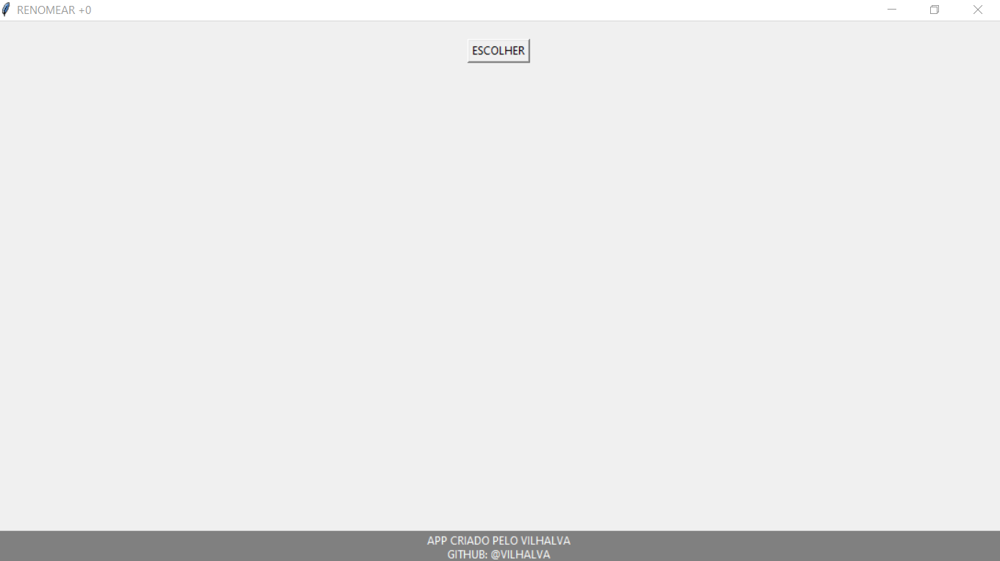

# RENOMEAR PARA 0
🎈COLOQUE O "0" COMO PRIMEIRO CARACTER GLOBALMENTE.

  

## DESCRIÇÃO:
O programa "Renomear Arquivos" é uma aplicação de desktop simples e amigável, desenvolvida em Python com a biblioteca Tkinter (tk). Sua principal finalidade é permitir ao usuário renomear arquivos em um diretório escolhido, adicionando "0" como o primeiro caractere do nome do arquivo. Esse recurso pode ser útil quando você deseja padronizar os nomes de arquivos em uma pasta, especialmente quando os nomes dos arquivos começam com números.

## RECURSOS:
1. **Escolher Diretório:** O programa oferece um botão "Escolher Diretório" que abre uma caixa de diálogo para permitir ao usuário selecionar o diretório que contém os arquivos a serem renomeados.

2. **Renomeação dos Arquivos:** Após escolher o diretório, o programa verifica todos os arquivos no diretório e renomeia qualquer arquivo cujo nome comece com números, adicionando um "0" como o primeiro caractere.

3. **Feedback ao Usuário:** O programa fornece feedback visual ao usuário para informar que os arquivos foram renomeados com sucesso. Um rótulo de informações é atualizado com uma mensagem após a renomeação.

## COMO USAR? 
1. Execute o programa.
2. Clique no botão "Escolher Diretório" e selecione o diretório que contém os arquivos que você deseja renomear.
3. Após a renomeação dos arquivos, um rótulo exibirá uma mensagem indicando que a operação foi concluída.

**Nota:** Este programa é um exemplo de aplicação básica com a funcionalidade de renomeação de arquivos. Você pode personalizá-lo ou estender suas capacidades de acordo com suas necessidades. Certifique-se de que a biblioteca Tkinter esteja instalada no ambiente Python para executar o programa.
